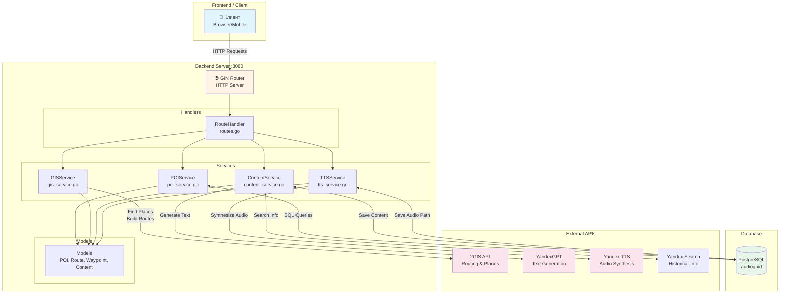
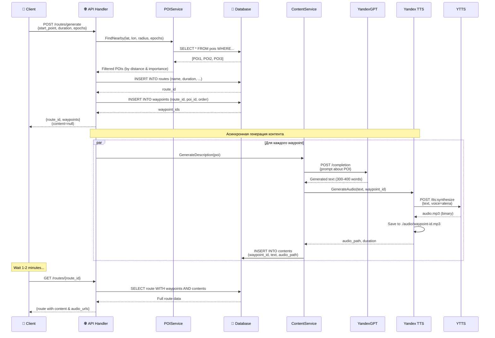
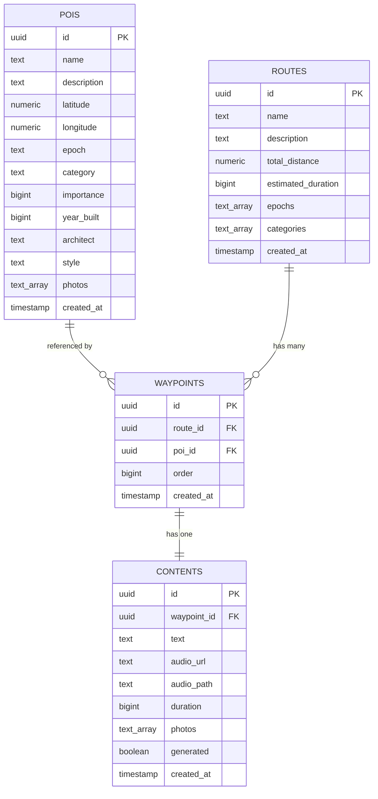
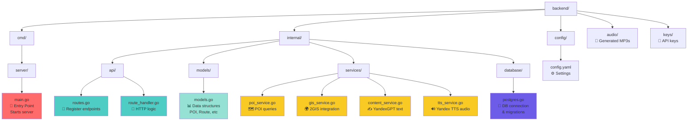
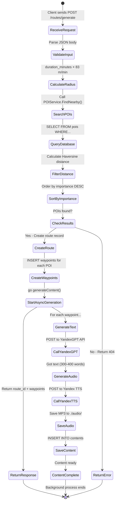
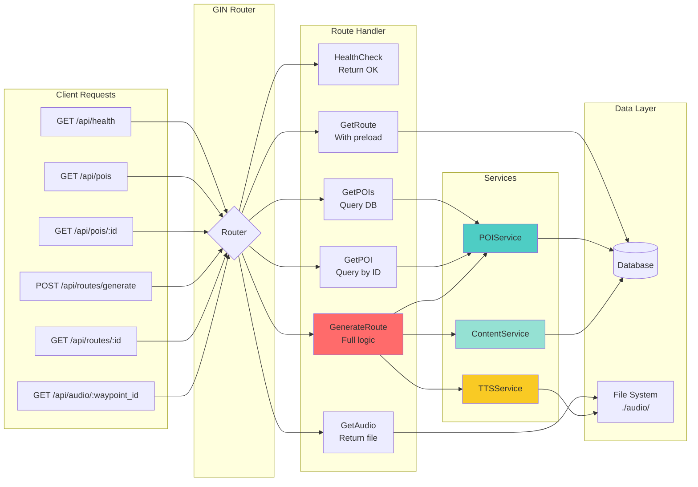
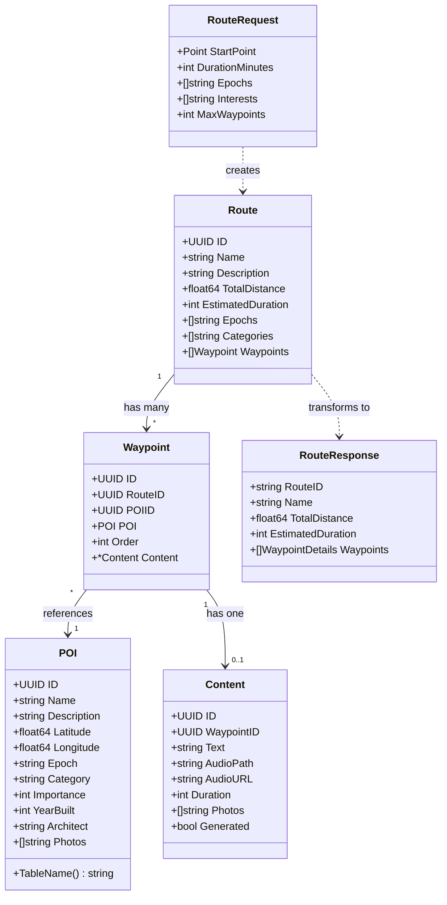
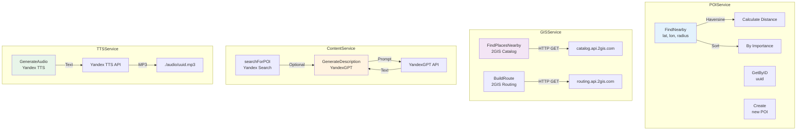
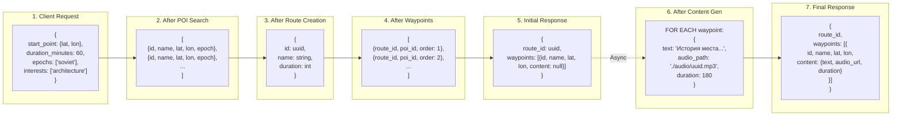

# 🎨 Визуальные Диаграммы Архитектуры

## 1. Общая Архитектура Системы



## 2. Поток Генерации Маршрута



## 3. Структура Базы Данных



## 4. Структура Директорий с Описанием



## 5. Жизненный Цикл Запроса



## 6. Обработка HTTP Endpoints



## 7. Модели Данных и Их Связи



## 8. Сервисы и Их Взаимодействие



## 9. Процесс Поиска POI

```mermaid
flowchart TD
    START([Start: FindNearby])
    
    INPUT[Input:<br/>lat, lon, radius<br/>epochs, categories]
    
    QUERY[Build SQL Query<br/>WITH filters]
    
    DBQUERY[(SELECT * FROM pois<br/>WHERE epoch IN (...)<br/>AND category IN (...))]
    
    LOOP{For each POI}
    
    CALC[Calculate Distance<br/>Haversine formula]
    
    CHECK{Distance <= radius?}
    
    ADD[Add to results]
    
    SKIP[Skip POI]
    
    SORT[Sort by Importance<br/>DESC]
    
    RETURN[Return POI list]
    
    END([End])
    
    START --> INPUT
    INPUT --> QUERY
    QUERY --> DBQUERY
    DBQUERY --> LOOP
    LOOP -->|Yes| CALC
    CALC --> CHECK
    CHECK -->|Yes| ADD
    CHECK -->|No| SKIP
    ADD --> LOOP
    SKIP --> LOOP
    LOOP -->|No more| SORT
    SORT --> RETURN
    RETURN --> END
    
    style START fill:#4caf50
    style END fill:#f44336
    style CHECK fill:#ff9800
```

## 10. Формат Данных на Каждом Этапе



---

## Как Использовать Диаграммы

### В GitHub/GitLab
Эти диаграммы автоматически рендерятся в Markdown на GitHub/GitLab

### Конвертация в PNG
```bash
# Установить mmdc (mermaid-cli)
npm install -g @mermaid-js/mermaid-cli

# Конвертировать
mmdc -i ДИАГРАММЫ.md -o diagrams.png
```

### Онлайн редактор
Откройте https://mermaid.live/ и скопируйте код диаграммы

### VS Code
Установите расширение "Markdown Preview Mermaid Support"

---

**Все диаграммы созданы с помощью Mermaid - простого языка для создания диаграмм из текста!** 🎨
